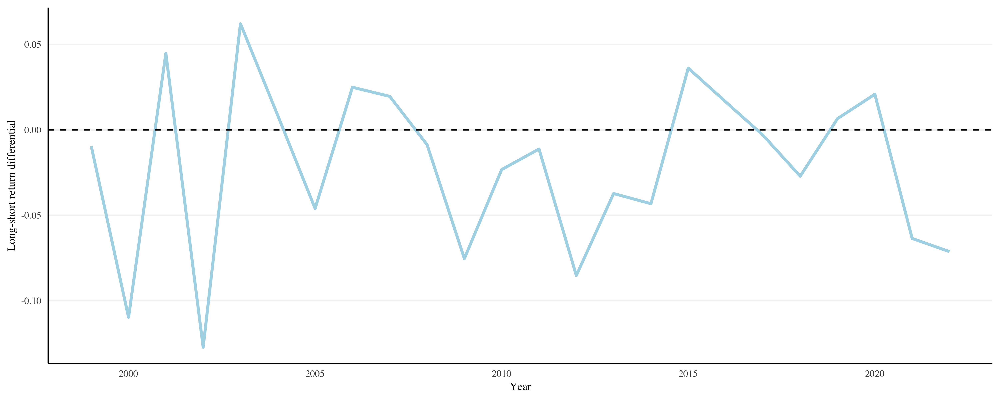
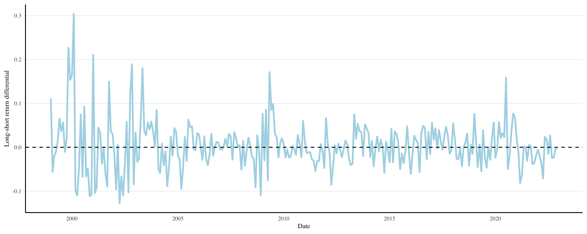
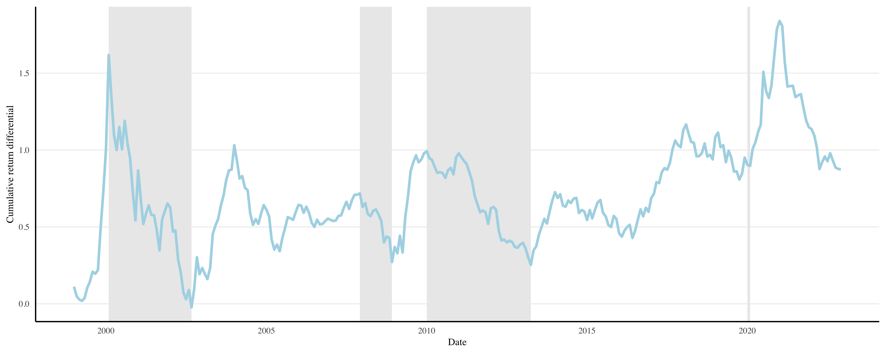

# Portfolio Sorts

Fama and French (1993) established the common procedure to estimate the relation between stock characteristics and expected returns with portfolio sorts. Now, we are faced with a factor zoo (see, e.g., Harvey, Liu, and Zhu, 2016; Chen and Zimmermann, 2022; among others). In this exercise, the aim is to replicate a return differential from portfolio sort based on R&D expenditure, apply factor models to it, and obtain factor exposures and risk metrics.

## Reproducing a return differential

### Constructing the sorting variable 

This paper investigated the impact of companies' research and development (R&D) expenditure on their returns in the following year, following a comprehensive exploration of potential sorting variables for portfolios, as discussed in the work by Walter et al. (2022).

During the period spanning from 1975 to 1995, a comprehensive study was conducted by Chan et al. (2001) that involved the categorization and analysis of stocks based on their R&D expenditure in relation to their market value of equity. This paper will try to replicate the R&D sorting variable proposed by Chan et al. (2001) from the year 1999 to 2022. This evaluation was performed annually as well as monthly, specifically at the end of April each year.

This process involved the ranking of stocks according to their R&D expenditure relative to their market value of equity. By employing this criterion, stocks were effectively classified into five distinct portfolios, each consisting of an equal number of stocks. However, it is important to note that stocks with no recorded R&D expenditures were assigned to a separate and distinct portfolio by Chan et al. (2001), allowing for a comprehensive examination of their performance. In this paper, these stocks with no data will not be taken into consideration for the return differential calculations. To ensure the reliability and representativeness of the findings, the sample for this study encompassed all domestic primary issues from prominent stock exchanges such as NYSE, AMEX, and Nasdaq. The coverage of these stocks was duly confirmed through the utilization of reliable and reputable sources, specifically the CRSP (Center for Research in Security Prices) and COMPUSTAT files, which served as valuable repositories of relevant financial and market data.

Overall, this detailed study provided a robust framework for evaluating the performance and market behavior of stocks based on their R&D expenditure relative to their market value of equity. By incorporating comprehensive data from reputable sources and employing a systematic approach to categorization, we were able to gain valuable insights into the role of R&D investment in shaping stock performance during the specific period under examination.
Table 1 presents summary statistics for four variables: "Market Value of Equity," "Yearly Sales," "R and D Expenditure," and "R and D Sorting Variable." The data set used for the calculations consists of 17,246 observations for each variable.

For the **Market Value of Equity** variable, the mean value is 12,474.26M USD, indicating that, on average, the equity value of the companies in the data set is around 12,474.26M USD. The median value is 1,305.618 USD, which suggests that the distribution of equity values is skewed, with a few companies having significantly higher values. The standard deviation is 57,200.18M USD, indicating a high degree of variability in the equity values among the companies.

The **Yearly Sales** variable has a mean value of 8,515.83M USD, indicating that, on average, the companies in the data set have yearly sales of approximately 8,515.83M USD. The median value is 806.48M USD, suggesting that the distribution of sales values is skewed, with a few companies having considerably higher sales. The standard deviation is 30,995.72M USD, indicating a large variation in sales among the companies.

The **R & D Expenditure** variable has a mean value of 331.77M USD, indicating that, on average, the companies in the data set spend approximately 331.77M USD on research and development. The median value is 15.35M USD, suggesting that the distribution of expenditure values is highly skewed, with a few companies having significantly higher spending. The standard deviation is 1,375.43M USD, indicating a considerable variability in R&D expenditures among the companies.

The **R & D Sorting Variable** is a dimensionless variable with a mean value of 0.074 and a median value of 0.018. The standard deviation is 0.430, indicating some variability in the sorting variable across the companies.

<table style="text-align:center"><caption><strong>Table 1: Summary statistics.</strong></caption>
<tr><td colspan="5" style="border-bottom: 1px solid black"></td></tr><tr><td style="text-align:left">Statistic</td><td>N</td><td>Mean</td><td>Median</td><td>St. Dev.</td></tr>
<tr><td colspan="5" style="border-bottom: 1px solid black"></td></tr><tr><td style="text-align:left">Market Value of Equity*</td><td>17,246</td><td>12,474.260</td><td>1,305.618</td><td>57,200.180</td></tr>
<tr><td style="text-align:left">Yearly Sales*</td><td>17,246</td><td>8,515.833</td><td>806.478</td><td>30,995.720</td></tr>
<tr><td style="text-align:left">R and D Expenditure*</td><td>17,246</td><td>331.767</td><td>15.346</td><td>1,375.432</td></tr>
<tr><td style="text-align:left">R and D Sorting Variable</td><td>17,246</td><td>0.074</td><td>0.018</td><td>0.430</td></tr>
<tr><td colspan="5" style="border-bottom: 1px solid black"></td></tr></table>

\*Values in millions USD. Table 1 was created using stargazer v.5.2.3 by Hlavac (2018).

### Sorting stocks into portfolios

<figcaption align = "center"><b>Table 2: Summary statistics grouped by the R&D Sorting Variable.</b></figcaption> 
 

|                        | 1 (Low)|        2|        3|        4| 5 (High)|
|:-----------------------|-------:|--------:|--------:|--------:|--------:|
|Market Value of Equity* | 8047.89| 16676.36| 18804.50| 14835.64|  3996.95|
|Yearly Sales*           | 8058.44|  9942.05|  7807.86|  6624.91| 10138.54|
|R&D Expenditure*        |    0.00|    90.60|   333.50|   572.40|   665.65|
|R&D Sorting Variable    |    0.00|     0.01|     0.02|     0.04|     0.30|

\*Values in millions USD.

Table 2 presents summary statistics grouped by the R&D Sorting Variable, with each group representing a different level of sorting variable, ranging from 1 (Low) to 5 (High). The following variables are described:

**Market Value of Equity**: The average market value of equity for each group is reported. The values range from 3996.95M USD for the high sorting variable (5) to 18804.51M USD for the third sorting variable (3). The low sorting variable (1) has a market value of equity of 8047.89M USD.

**Yearly Sales**: The average yearly sales figures are provided for each group. The values range from 6624.91M USD for the fourth sorting variable (4) to 10138.54M USD for the fifth sorting variable (High). The first sorting variable (Low) has a yearly sales average of 8058.44M USD.

**R&D Expenditure**: The average R&D expenditure is reported for each group. The values range from 0.000 for the low sorting variable (1) to 665.653 for the high sorting variable (5). The second sorting variable (2) has an average R&D expenditure of 90.6M USD.

**R&D Sorting Variable**: The average value of the R&D sorting variable is provided for each group. The values range from 0.000 for the low sorting variable (1) to 0.302 for the high sorting variable (5). The second sorting variable (2) has an average value of 0.005.

<figcaption align = "center"><b>Table 3: Mean returns of sorted portfolios.</b></figcaption> 
 

|                | 1 (Low)|    2|    3|    4| 5 (High)|
|:---------------|-------:|----:|----:|----:|--------:|
|Monthly Returns |    0.01| 0.01| 0.01| 0.01|     0.02|
|Yearly Returns  |    0.03| 0.04| 0.04| 0.03|     0.01|

The five R&D portfolios, ranging from low (1) to high (5), exhibit varying levels of performance, as depicted in Table 3. It appears that as the R&D portfolio level increases, the yearly returns generally decrease. Specifically, the high R&D portfolio (5) has the lowest yearly return of 0.014, while the low R&D portfolio (1) has the highest yearly return of 0.034.

**Yearly Returns**: The yearly returns for the R&D portfolios, ranging from 0.014 to 0.037, exhibit relatively consistent performance. There is a relatively small range between the highest and lowest yearly returns, indicating a degree of stability across the portfolios.

**Monthly Returns**: The monthly returns for the R&D portfolios, ranging from 0.012 to 0.0161, display smaller fluctuations compared to the yearly returns. The data suggests that the monthly returns are relatively consistent across the R&D portfolios. The monthly returns show a relatively stable pattern, with all values falling within a narrow range. This suggests that there may be less variability in performance on a monthly basis compared to yearly returns.

These observations provide a preliminary understanding of the relationship between R&D portfolios and their corresponding yearly and monthly returns. However, it is important to conduct further analysis and consider additional factors to obtain a more comprehensive and accurate assessment.

### Computing the long-short return differential

The long-short return differential measures the difference in mean of the return between the high (5) R&D portfolio and the low (1) R&D portfolio for each point in time in a specific time period and frequency chosen.

<figcaption align = "center"><b>Figure 1: Long-short return differential.</b></figcaption> 
 

Figure 1 displays the results of the yearly calculations for the long-short return differentials. Notably, the majority of these differentials tend to be slightly below zero, particularly during periods of economic downturns. This observation reinforces the previous finding that, on the whole, the portfolio with lower (1) R&D ratio generally outperforms the portfolio with higher (5) ratio Additionally, the occurrence of even lower peaks during years of economic crises, such as 2003, 2009, and 2012, suggests a potential influence of economic cycles on the performance of these portfolios. This effect further amplifies the disparities between the high and low portfolios, underscoring the impact of economic conditions on their relative performance.

<figcaption align = "center"><b>Figure 2: Monthly Long-short return differential.</b></figcaption> 
 

In the context of the monthly return differentials depicted in Figure 2, it becomes evident how the return differentials exhibit greater volatility over shorter time periods. This volatility is accompanied by occasional extreme values, such as a notable peak in February 2000 and a low of -0.12 in April 2002. These particular dates are closely associated with the well-known dot-com bubble, which further highlights the influence of economic cycles on the observed differences in portfolio performance over time.

However, it is important to note that the data exhibits a high level of volatility, making it challenging to identify a consistent trend. The fluctuating nature of the return differentials emphasizes the dynamic nature of the portfolios under the sorting variable and underscores the need to consider the impact of economic cycles when analyzing their relative performance.

## Analyzing the return differential

### Plotting the cumulative return differential's time series. How can it be used to assess the riskiness of the strategy?

The calculation results are visualized in the cumulative return differential time series shown in Figure 3. The overall trend observed in the cumulative return differential indicates a positive trajectory with a Compound Annual Growth Rate (CAGR) of 9.15%. This suggests that the portfolio return differentials have experienced consistent growth over the observed period.

The graph also effectively captures the influence of various economic cycles that have occurred throughout the analyzed timeframe. Notably, it illustrates the impact of significant events such as the dot-com bubble crisis spanning from 2000 to 2003, the global financial crisis in 2008-2009, and the subsequent crisis from 2010 to 2013. These periods of economic turbulence are clearly reflected in the fluctuations of the cumulative return differential. Additionally, the graph highlights the impact of the COVID-19 pandemic, we can see the shock February-March 2020. 

In general, the time series of the return differentials exhibits a behaviour closely aligned with the overall economy, indicating its exposure to the risks prevalent in the market during the studied period. To gain a deeper understanding of this exposure, it would be beneficial to utilize models like the Capital Asset Pricing Model (CAPM) or conduct graphical comparisons with reference indexes. These approaches can help determine whether the return differentials of our portfolio are relatively less or more exposed to risk factors compared to the broader market. 

<figcaption align = "center"><b>Figure 3: Monthly cumulative return differential time series.</b></figcaption> 
 

### Using the CAPM (Sharpe, 1964), and the Fama & French (1993) three-factor model to assess the return differential's risk exposures. What do these models imply for the riskiness of the return differential?

To assess the return differential's risk exposures, a regression analysis between the excess return differential and two different factors models (CAPM (Sharpe, 1964) and Fama & French (1993) 3-factor model are performed.

<table style="text-align:center"><caption><strong>Table 4: Regression Results for CAPM</strong></caption>
<tr><td colspan="2" style="border-bottom: 1px solid black"></td></tr><tr><td style="text-align:left"></td><td>(longshort - RF)</td></tr>
<tr><td colspan="2" style="border-bottom: 1px solid black"></td></tr><tr><td style="text-align:left">Mkt.RF</td><td>0.482*** (0.067)</td></tr>
<tr><td style="text-align:left">Constant</td><td>-0.0003 (0.003)</td></tr>
<tr><td colspan="2" style="border-bottom: 1px solid black"></td></tr><tr><td style="text-align:left">Observations</td><td>288</td></tr>
<tr><td style="text-align:left">R2</td><td>0.155</td></tr>
<tr><td style="text-align:left">Adjusted R2</td><td>0.152</td></tr>
<tr><td style="text-align:left">Residual Std. Error</td><td>0.052 (df = 286)</td></tr>
<tr><td style="text-align:left">F Statistic</td><td>52.547*** (df = 1; 286)</td></tr>
<tr><td colspan="2" style="border-bottom: 1px solid black"></td></tr><tr><td style="text-align:left"><em>Note:</em></td><td style="text-align:right">*p<0.1; **p<0.05; ***p<0.01</td></tr>
</table>
  
Table 4 was created using stargazer v.5.2.3 by Hlavac (2018).

**CAPM (Sharpe, 1964)**: The CAPM model (Sharpe, 1964) includes only the market risk factor (Mkt.RF):
$$r_i = r_f + \beta_i (r_m - r_f)$$

The coefficient for Mkt.RF is statistically significant (p-value \< 0.001), indicating that market risk is a significant factor in explaining the return differential (Table 4). However, the CAPM model (Sharpe, 1964) has a relatively low adjusted R-squared value of 0.1523, suggesting that it may not fully capture the variations in the return differential. In general, the return differentials exhibit lower volatility or reduced risk compared to the overall market, as evidenced by their beta coefficient of 0.482, which is significantly below 1—the benchmark for overall market volatility.

**Fama & French (1993) three-factor model**: The Fama & French (1993) three-factor model includes Mkt.RF, SMB (Size factor), and HML (Value factor):
$$r_i = r_f + \beta_i^M (r_m - r_f) + \beta_i^S SMB + \beta_i^V HML$$

All three factors (Mkt.RF, SMB, HML) have statistically significant coefficients (p-values \< 0.001), indicating their significant role in explaining the return differential (Table 5). The adjusted R-squared value of the model improves to 0.3469, suggesting a better fit compared to the CAPM model (Sharpe, 1964).

The positive coefficient for the market factor (0.376) suggests that the return differentials are positively correlated with overall market risk. The positive coefficient for the size factor (0.489) indicates a higher sensitivity to the risk associated with small-cap stocks. Conversely, the negative coefficient for the value factor (-0.592) suggests a negative relationship with the risk associated with value stocks. Overall, these coefficients imply that the return differentials are influenced by market risk, exhibit sensitivity to small-cap stock risk, and may have a contrasting risk profile compared to value stocks.

<table style="text-align:center"><caption><strong>Table 5: Regression Results for Fama-French 3-Factor Model</strong></caption>
<tr><td colspan="2" style="border-bottom: 1px solid black"></td></tr><tr><td style="text-align:left"></td><td>(longshort - RF)</td></tr>
<tr><td colspan="2" style="border-bottom: 1px solid black"></td></tr><tr><td style="text-align:left">Mkt.RF</td><td>0.376*** (0.061)</td></tr>
<tr><td style="text-align:left">SMB</td><td>0.489*** (0.089)</td></tr>
<tr><td style="text-align:left">HML</td><td>-0.592*** (0.077)</td></tr>
<tr><td style="text-align:left">Constant</td><td>-0.0002 (0.003)</td></tr>
<tr><td colspan="2" style="border-bottom: 1px solid black"></td></tr><tr><td style="text-align:left">Observations</td><td>288</td></tr>
<tr><td style="text-align:left">R2</td><td>0.354</td></tr>
<tr><td style="text-align:left">Adjusted R2</td><td>0.347</td></tr>
<tr><td style="text-align:left">Residual Std. Error</td><td>0.046 (df = 284)</td></tr>
<tr><td style="text-align:left">F Statistic</td><td>51.811*** (df = 3; 284)</td></tr>
<tr><td colspan="2" style="border-bottom: 1px solid black"></td></tr><tr><td style="text-align:left"><em>Note:</em></td><td style="text-align:right">*p<0.1; **p<0.05; ***p<0.01</td></tr>
</table>
  
Table 5 was created using stargazer v.5.2.3 by Hlavac (2018).

### Computing the return differentials risk measures: 95% and 99% value-at-risk and expected shortfall. Contrasting the findings to the size and value factors from Fama and French (1993).

The Fama and French (1993) model introduced two factors, namely the size factor and the value factor, to explain stock returns. These factors have been widely used in finance to analyze and interpret the performance of investment portfolios. In contrast to the size and value factors from Fama and French, Expected Shortfall (ES) and Value at Risk (VaR) are risk measures that focus on quantifying the downside risk of an investment portfolio or asset. Expected shortfall is calculated by averaging all the returns in the distribution that are worse than the VaR of the portfolio at a given level of confidence. Value at risk does not assess the tail end of the distribution of loss, meaning its scope is limited. In contrast, expected shortfall is more sensitive to the shape of the tail of the loss distribution.

<figcaption align = "center"><b>Table 6: Value at Risk.</b></figcaption> 
 

|                    |95%    |99%     |
|:-------------------|:------|:-------|
|Return differential |-8.74% |-10.98% |
|SMB                 |-4.75% |-6.49%  |
|HML                 |-4.20% |-6.49%  |

Table 6 suggests that there is a 95% probability that the loss of the sorted portfolio will not exceed 8.74%. For the size and value factors, the losses should not exceed 5.23% and 4.24%, respectively. This indicates that the Value at Risk (VaR) at 95% is more pronounced for the sorting portfolio, meaning the SMB and HML risk factors generate more stable returns at the given confidence level. Furthermore, we can observe a similar pattern at the 99% confidence level, as the VaR of the sorting portfolio is a loss of 10.98%, while for the size and value factors, the VaRs are losses of 6.49%.

<figcaption align = "center"><b>Table 7: Expected Shortfall.</b></figcaption> 
 

|                    |95%     |99%     |
|:-------------------|:-------|:-------|
|Return differential |-10.23% |-11.61% |
|SMB                 |-7.57%  |-10.19% |
|HML                 |-5.92%  |-10.19% |

When it comes to expected shortfall, Table 7 suggests that the expected loss of the sorting portfolio is 10.23% at a 95% confidence level. The expected shortfall of the size and value risk factors is 7.57% and 5.92%, respectively, indicating a higher volatility for the sorting portfolio compared to the SMB and HML risk factors. However, the differences in expected shortfall at a 99% confidence level are not as pronounced for the different risk factors. This suggests that the return distribution has relatively flatter tails for the SMB and HML risk factors compared to the return differential of the sorting portfolio.

Hence, we can conclude that the size and value risk factors carry smaller associated risks than the sorting portfolio.

## References

Chan, L. K. C., Lakonishok, J., & Sougiannis, T. (2001). The stock market valuation of research and development expenditures. The Journal of Finance, 56, 2431–2456.

Fama, E. F., & French, K. R. (1993). Common risk factors in the returns on stocks and bonds. Journal of Financial Economics, 33, 3–56.

Hlavac, M. (2018). Stargazer: Well-formatted regression and summary statistics tables. Central European Labour Studies Institute (CELSI).

Sharpe, W. F. (1964). Capital asset prices: A theory of market equilibrium under conditions of risk. The Journal of Finance, 19, 425–442.

Walter, D., Weber, R., & Weiss, P. (2022). Non-standard errors in portfolio sorts. Working Paper.

## Authors

Beatriz Herrera García, Ema Vargová
